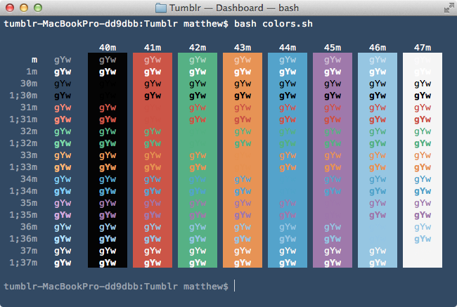
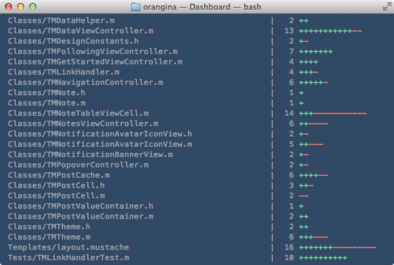

# Tumblr Terminal Theme

*A [Mac OS X Terminal](http://en.wikipedia.org/wiki/Terminal_(OS_X)) Theme That Matches the [Tumblr Dashboard](http://tumblr.com/dashboard)*

I work at Tumblr, and I use Terminal. One day I decided that my Terminal should match my Tumblr Dashboard, so this is the product of that.  If you also love Tumblr and Terminal, [we’re hiring](http://tumblr.com/jobs) engineers.

## Install

To use the theme, download or clone the repository and double-click the Tumblr.terminal file. You can make it your default theme in Terminal.app’s Preferences.

## What it Looks Like

